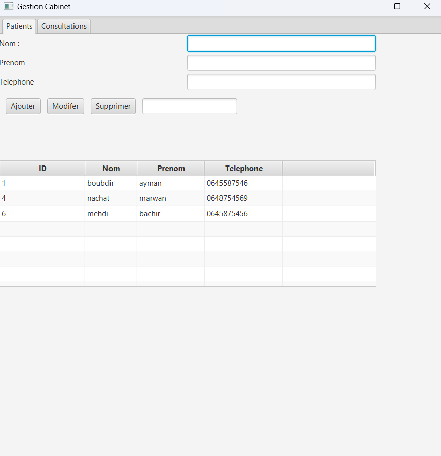

# Système de Gestion de Cabinet Médical

## Résumé
Le Système de Gestion de Cabinet Médical est une application JavaFX complète conçue pour optimiser la gestion d'un cabinet médical. Elle permet une gestion efficace des dossiers des patients, des rendez-vous et des consultations grâce à une interface conviviale.

## Fonctionnalités principales
- Gestion des patients : Ajout, mise à jour et suppression des dossiers des patients.
- Gestion des consultations : Suivi des consultations des patients et de leur historique médical.
- Fonction de recherche : Recherche des patients par nom ou identifiant.
- Interface intuitive : Une interface facile à naviguer pour simplifier les opérations quotidiennes.



## Installation
1. Cloner le dépôt GitHub :
   ```sh
   git clone https://github.com/votre-nom-utilisateur/gestion-cabinet-medical.git
